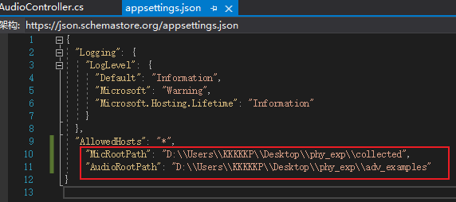

# audio_physical_experiment_helper

## 后端

1. 配置文件路径

   

   **AudioRootPath**：存放播放语音的根路径，系统会自动在其下创建 "sr" 和 "asr" 两个任务子目录。分别将两个任务需要播放的音频放入相应的目录下，支持在任务子目录下用子文件夹组织音频。实验完成后，数据采集目录下会具有与任务子目录相同的组织结构，每条播放音频都会在数据采集目录下有一条对应的采集音频。*并在该目录下放置一个名为 test.wav 的任意语音与 sr 和 asr 目录同级，用于测试。*

   **MicRootPath**：存放采集语音的根目录，其下会根据实验条件建立相应的子目录结构。

2. 运行

   查看运行端口

3. 在防火墙中放开端口

## 前端

1. 安装

   npm install

   npm install --save js-audio-recorder

2. 运行

   npm run serve

## 使用

1. 移动设备须与运行前后端的主机（服务器）处于同一局域网中
2. https尚无安全认证，在浏览器中先访问后端api https://192.168.123.53:5000/api/audio/playaudio?path=test.wav （注意替换为服务器局域网ip地址和**后端**端口）
3. 打开前端页面 https://192.168.123.53:8081/（注意替换为服务器局域网ip地址和**前端**端口），选择相应的服务器。